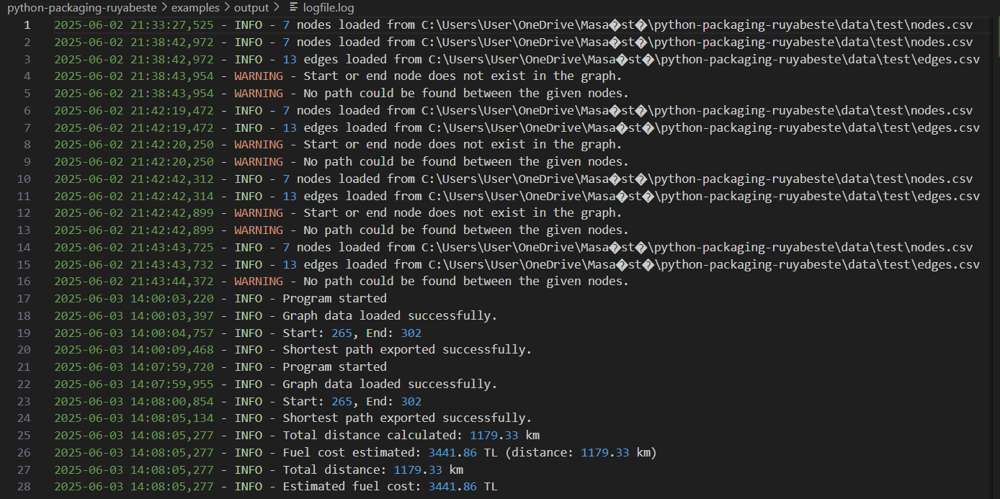
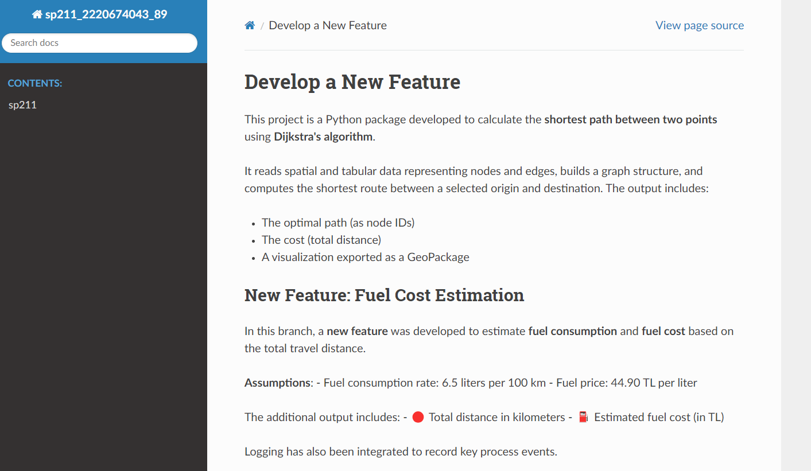
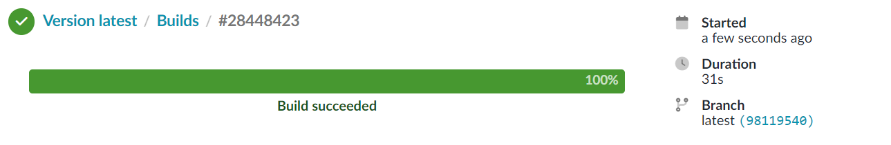

# SP211

This project aims to implement a route optimization solution based on Dijkstra's algorithm, enhanced with a new feature: **fuel cost estimation**. Using a custom graph structure and data parsed from CSV files, the application computes the shortest path and calculates travel expenses based on distance and fuel parameters.

---

##  Project Development Roadmap

| Step | Description |
|------|-------------|
| 1 | Implemented the Graph class and Dijkstra’s algorithm to compute the shortest path |
| 2 | Wrote unit tests to validate core functionality using sample data |
| 3 | Developed a new feature: fuel cost estimation based on total travel distance |
| 4 | Created a separate feature branch (`new-feature`) and added the new functionality |
| 5 | Wrote test cases for the new feature to ensure correctness |
| 6 | Integrated logging to track inputs, outputs, and errors during runtime |
| 7 | Documented the codebase and the new feature using Sphinx |
| 8 | Packaged the project with `pyproject.toml` and uploaded it to TestPyPI |

---

## Develop a New Feature

### Feature Script: `new_feature.py`
```python
import geopandas as gpd
import logging

def calculate_total_distance(gpkg_path, layer_name="shortest_path"):
    """
    Calculates the total distance (in kilometers) of the exported shortest path.
    """
    gdf = gpd.read_file(gpkg_path, layer=layer_name)
    gdf = gdf.to_crs(epsg=3857)  # Convert to metric projection
    total_km = gdf.length.sum() / 1000  # Convert from meters to km

    logging.info(f"Total distance calculated: {total_km:.2f} km")
    return total_km

def calculate_fuel_cost(distance_km, consumption_l_per_100km=6.5, fuel_price_per_liter=44.90):
    """
    Estimates fuel cost based on distance, consumption rate and fuel price.
    """
    cost = (distance_km / 100) * consumption_l_per_100km * fuel_price_per_liter
    logging.info(f"Fuel cost estimated: {cost:.2f} TL (distance: {distance_km:.2f} km)")
    return cost
```

📌 What It Does:

This function calculates how much the user will spend on fuel along the computed shortest path:

- Uses the actual segment weights (costs) from the graph
- Accepts user-specified fuel efficiency (e.g., 6.5 L/100km) and fuel price per liter (e.g., 44.90 TL)
- Returns cost in currency format (TL)

Assumptions:
- Fuel consumption is based on a typical sedan vehicle average (6.5 L/100km)
- Fuel price (44.90 TL/liter) is based on a recent average value in Turkey as of June 2025
- The car’s fuel tank size is not directly relevant, as the function computes cost only for the required amount of fuel for the calculated route (not full tank consumption)

This makes the project **practically useful** for logistics, road trip planning, and energy-efficient routing.

---

## 📊 Logging Integration

I implemented logging to automatically track output and potential issues. Logs are written to `examples/output/logfile.log`.



### 🔍 Why Logging?
- To capture results (distance, fuel cost)
- To catch missing inputs, errors, or misconfigurations
- Improves **debuggability** and **reliability** during execution

---

## 📚 Documentation

Documentation was generated using Sphinx. An example screenshot is below:



🔗 [Open local documentation](C:/Users/User/OneDrive/Masaüstü/python-packaging-ruyabeste/docs/build/html/index.html)

---

## 📦 Package Deployment
The project was successfully packaged and published on TestPyPI. You can install it using the following command:
- pip install -i https://test.pypi.org/simple/ sp211-2220674043-89

---

##  AI Use Statement

Throughout this project;

- I got help during the code development phase. I had the points I could not understand explained.
- I got help for the script I created for documentation with Sphinx
- I got help understanding and fixing technical issues and code errors I encountered.


---

## PHASE 2

🧪 Unit Testing
I migrated test structure to use the unittest framework. Separate test files were created for each new function:
- test_newfeature_totaldistance.py
- test_newfeature_fuelcost.py

All tests are located in the tests/ directory and run automatically via CI upon each push or pull request.

⚙️ CI Integration (GitHub Actions)
I integrated a CI pipeline using GitHub Actions that includes:
- Dependency installation (including geopandas, pytest, twine, etc.)
- Automatic test execution using unittest
- Package building with build

⚠️ Automatic TestPyPI upload was skipped since I cannot store API tokens as secrets in GitHub Classroom repositories. Even after cloning to a public repository, the integration was unsuccessful.

📚 Documentation on Read the Docs
This project is now also documented with Sphinx and hosted on Read the Docs.

The docs/ folder includes all reStructuredText source files.

The documentation is automatically built and published on push using .readthedocs.yaml.



# Use of AI
Throughout the development of Phase 2, AI was used to:
- Guide test structure migration to unittest
- Help debug CI pipeline failures
- Suggest fixes for Read the Docs integration issues

